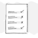
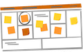

# DIU
Prácticas Diseño Interfaces de Usuario 2021-22 (Tema: Hostel4U) 

Grupo: DIU3_14PI.  Curso: 2021/22 
Updated: 19/5/2022

Proyecto: 
>>> 4U Conciertos

Descripción: 

>>> Proporcionar información sobre conciertos en directo dentro de nuestro hostel

Logotipo: 
>>> 

Miembros
 * :bust_in_silhouette:   Carlos Pérez Cruz     :octocat:     
 * :bust_in_silhouette:  Alejandro Rodger Marín     :octocat:

----- 

# Proceso de Diseño 

## Paso 1. UX Desk Research & Analisis 

 1.a Competitive Analysis
-----

>>> Comparando el análisis de los hostels mencionados en la práctica, y visualizando el diseño de las páginas de cada uno, podemos decantarnos por el hostel que estamos estudiando, HOSTEL4U, por la relación calidad/precio y el atractivo de las fotos que nos muestran del lugar, por la cantidad de servicios que ofrecen con respecto al resto y las diversas formas de pago que disponen. Todo esto hacen de este hostal un sitio realmente interesante. Los otros dos que comparamos en la práctica también son válidos, pero HOSTEL4U es el más barato de los tres, y cuenta con servicios más interesantes.

 1.b Persona
-----

>>> Hemos elegido a Joseph y a Sophie porque representan a dos grupos de edades distintas (joven y mediana edad) con objetivos muy distintos en su paso por el hostel. Joseph quiere escapar de la monotonía de su vida y su trabajo en Inglaterra, tomandose unas vacaciones para descansar, mientras que Sophie quiere conocer lugares históricos de España y hacer deportes de montaña durante su estancia en nuestro país.

 1.c User Journey Map
----

>>> Hemos escogido estas experiencias de usuario acorde a las vidas de Joseph y Sophie, y a sus objetivos durante sus estancias en el hostel. Consideramos que se tratan de experiencias muy habituales que se dan en el hostel. Por una parte Joseph quiere descansar y tener unas vacaciones tranquilas por lo que pasa más tiempo en el hostel. Por otra parte Sophie viene con su pareja y quiere hacer más actividades fuera que dentro del hostel.

 1.d Usability Review
----
>>>  Revisión de usabilidad: (toma los siguientes documentos de referncia y verifica puntos de verificación de  usabilidad
>>>> SE deben incluir claramente los siguientes elementos
>>> - Enlace al documento:  (sube a github el xls/pdf) 
>>> - Valoración final (numérica): 
>>> - Comentario sobre la valoración:  (60-120 caracteres)

## Paso 2. UX Design  

 2.a Feedback Capture Grid / EMpathy map / POV
----

>>> Comenta con un diagrama los aspectos más destacados a modo de conclusion de la práctica anterior,

 Interesante | Críticas     
| ------------- | -------
  Preguntas | Nuevas ideas
  
    
>>> ¿Que planteas como "propuesta de valor" para un nuevo diseño de aplicación para economia colaborativa ?
>>> Problema e hipótesis
>>>  Que planteas como "propuesta de valor" para un nuevo diseño de aplicación para economia colaborativa te
>>> (150-200 caracteres)

 2.b ScopeCanvas
----
>>> Propuesta de valor 

 2.b Tasks analysis 
-----

>>> Definir "User Map" y "Task Flow" ... 

 2.c IA: Sitemap + Labelling 
----

>>> Identificar términos para diálogo con usuario  

Término | Significado     
| ------------- | -------
  Login¿?  | acceder a plataforma

 2.d Wireframes
-----

>>> Plantear el  diseño del layout para Web/movil (organización y simulación ) 

## Paso 3. Mi UX-Case Study (diseño)

 3.a Moodboard
-----

>>> Plantear Diseño visual con una guía de estilos visual (moodboard) 
>>> Incluir Logotipo
>>> Si diseña un logotipo, explique la herramienta utilizada y la resolución empleada. ¿Puede usar esta imagen como cabecera de Twitter, por ejemplo, o necesita otra?

  3.b Landing Page
----

>>> Plantear Landing Page 

 3.c Guidelines
----

>>> Estudio de Guidelines y Patrones IU a usar 
>>> Tras documentarse, muestre las deciones tomadas sobre Patrones IU a usar para la fase siguiente de prototipado. 

  3.d Mockup
----

>>> Layout: Mockup / prototipo HTML  (que permita simular tareas con estilo de IU seleccionado)

 3.e ¿My UX-Case Study?
-----

>>> Publicar my Case Study en Github..
>>> Documente y resuma el diseño de su producto en forma de video de 90 segundos aprox

## Paso 4. Evaluación 

 4.a Caso asignado
----

>>> Breve descripción del caso asignado con enlace a  su repositorio Github

 4.b User Testing
----

>>> Seleccione 4 personas ficticias. Exprese las ideas de posibles situaciones conflictivas de esa persona en las propuestas evaluadas. Asigne dos a Caso A y 2 al caso B
 

| Usuarios | Sexo/Edad     | Ocupación   |  Exp.TIC    | Personalidad | Plataforma | TestA/B
| ------------- | -------- | ----------- | ----------- | -----------  | ---------- | ----
| User1's name  | H / 18   | Estudiante  | Media       | Introvertido | Web.       | A 
| User2's name  | H / 18   | Estudiante  | Media       | Timido       | Web        | A 
| User3's name  | M / 35   | Abogado     | Baja        | Emocional    | móvil      | B 
| User4's name  | H / 18   | Estudiante  | Media       | Racional     | Web        | B 

. 4.c Cuestionario SUS
----

>>> Usaremos el **Cuestionario SUS** para valorar la satisfacción de cada usuario con el diseño (A/B) realizado. Para ello usamos la [hoja de cálculo](https://github.com/mgea/DIU19/blob/master/Cuestionario%20SUS%20DIU.xlsx) para calcular resultados sigiendo las pautas para usar la escala SUS e interpretar los resultados
http://usabilitygeek.com/how-to-use-the-system-usability-scale-sus-to-evaluate-the-usability-of-your-website/)
Para más información, consultar aquí sobre la [metodología SUS](https://cui.unige.ch/isi/icle-wiki/_media/ipm:test-suschapt.pdf)

>>> Adjuntar captura de imagen con los resultados + Valoración personal 

 4.d Usability Report
----

>> Añadir report de usabilidad para práctica B (la de los compañeros)

>>> Valoración personal 

>>> ## Paso 5. Evaluación de Accesibilidad  (no necesaria)

>>>   5.a Accesibility evaluation Report 
>>>> ----

>>> Indica qué pretendes evaluar (de accesibilidad) sobre qué APP y qué resultados has obtenido 

>>> 5.a) Evaluación de la Accesibilidad (con simuladores o verificación de WACG) 
>>> 5.b) Uso de simuladores de accesibilidad 

>>> (uso de tabla de datos, indicar herramientas usadas) 

>>> 5.c Breve resumen del estudio de accesibilidad (de práctica 1) y puntos fuertes y de mejora de los criterios de accesibilidad de tu diseño propuesto en Práctica 4.

## Conclusión final / Valoración de las prácticas

>>> (90-150 palabras) Opinión del proceso de desarrollo de diseño siguiendo metodología UX y valoración (positiva /negativa) de los resultados obtenidos  

