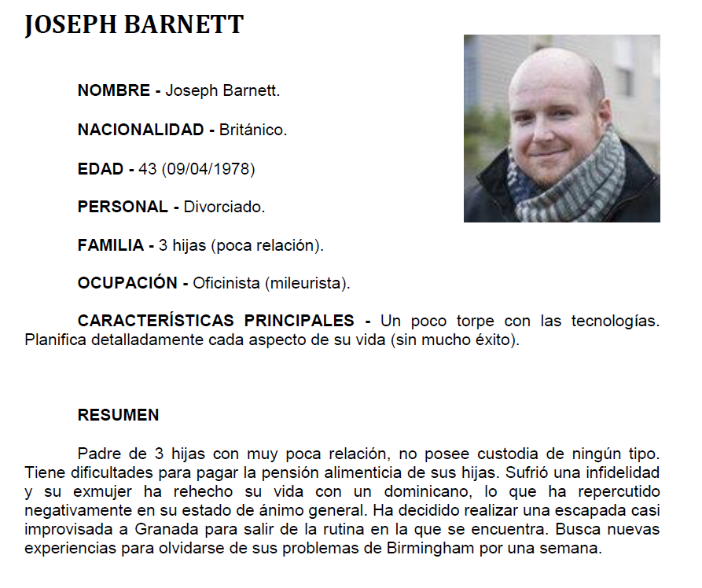
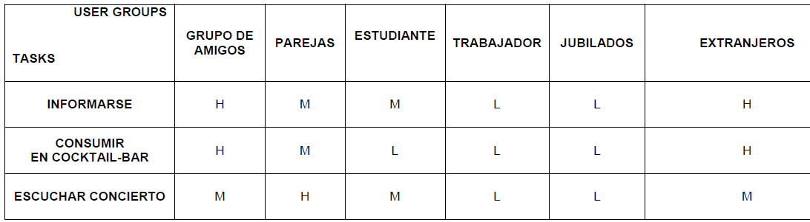

# DIU
Prácticas Diseño Interfaces de Usuario 2021-22 (Tema: Hostel4U) 

Grupo: DIU3_14PI.  Curso: 2021/22 
Updated: 19/5/2022

Proyecto: 4U Conciertos

Descripción: 

Con 4UConciertos buscamos proporcionar información sobre conciertos en directo dentro de nuestro hostel

Logotipo: 

Miembros
 * :bust_in_silhouette:   Carlos Pérez Cruz     :octocat:     
 * :bust_in_silhouette:  Alejandro Rodger Marín     :octocat:

----- 

# Proceso de Diseño 

## Paso 1. UX Desk Research & Analisis (<a href="P1/P1.pdf">P1</a>)

 1.a Competitive Analysis
-----

 Comparando el análisis de los hostels mencionados en la práctica, y visualizando el diseño de las páginas de cada uno, podemos decantarnos por el hostel que estamos estudiando, HOSTEL4U, por la relación calidad/precio y el atractivo de las fotos que nos muestran del lugar, por la cantidad de servicios que ofrecen con respecto al resto y las diversas formas de pago que disponen. Todo esto hacen de este hostal un sitio realmente interesante. Los otros dos que comparamos en la práctica también son válidos, pero HOSTEL4U es el más barato de los tres, y cuenta con servicios más interesantes.

 1.b Persona
-----

 Hemos elegido a Joseph y a Sophie porque representan a dos grupos de edades distintas (joven y mediana edad) con objetivos muy distintos en su paso por el hostel. Joseph quiere escapar de la monotonía de su vida y su trabajo en Inglaterra, tomandose unas vacaciones para descansar, mientras que Sophie quiere conocer lugares históricos de España y hacer deportes de montaña durante su estancia en nuestro país.

 1.c User Journey Map
----

 Hemos escogido estas experiencias de usuario acorde a las vidas de Joseph y Sophie, y a sus objetivos durante sus estancias en el hostel. Consideramos que se tratan de experiencias muy habituales que se dan en el hostel. Por una parte Joseph quiere descansar y tener unas vacaciones tranquilas por lo que pasa más tiempo en el hostel. Por otra parte Sophie viene con su pareja y quiere hacer más actividades fuera que dentro del hostel.

 1.d Usability Review
----
  Revisión de usabilidad: 
 - Enlace al documento:  <a href="P1/Usability_Review.pdf">Documento Usability Review</a>
 - Valoración final (numérica): 84
 - Comentario sobre la valoración:  Esta tabla nos da a conocer la puntuación total de la usabilidad sobre 100 de la página web de Hostel4U en base a una serie de puntuaciones de diferentes ámbitos de diseño de la página. En nuestro caso se ha obtenido una puntuación de 84 sobre 100 (good), lo que supone que el diseño de la página es apto para el uso de la misma con relativa facilidad.

## Paso 2. UX Design  (<a href="P2/P2.pdf">P2</a>)

 2.a Feedback Capture Grid / EMpathy map / POV
----

### Malla receptora

  
    
A partir de las preguntas realizadas por nuestros usuarios, concluimos que la idea de realizar un micro-sitio para conciertos en directo es apta.
Hemos decidido que se ofrezca un nuevo servicio en el hostel: conciertos de música en directo. Se organizarán conciertos en el Cocktail Bar o en el Sky Bar una vez a la semana. De esta manera, más gente acudirá al bar para realizar consumiciones y disfrutar de otros servicios del Hostel.

 2.b ScopeCanvas
----

 2.b Tasks analysis 
-----

Vamos a proceder a identificar las tareas que debe realizar los usuarios en el sitio. Para ello vamos a utilizar una matriz de tareas/usuarios donde se enumeran por filas las tareas, y los perfiles de usuario por columnas, indicando la relación entre ambos con su frecuencia de uso, organizada en Baja (L), Media (M), o Alta (H).

### Matriz tareas/usuarios

 2.c IA: Sitemap + Labelling 
----

Término | Significado     
| ------------- | -------
  Inicio  | Página de inicio con enlaces al resto de páginas y una breve descripción del servicio de conciertos en el hostel
  Calendario  | Página de información más detallada de los conciertos próximos.
  Galería  | Página con una galería de imágenes de los conciertos (y los sitios del hostel donde se hacen dichos conciertos)
  Contacto  | Página con un formulario para contactar con el hostel si se tiene alguna duda. El número y correo del hostel sale en todas las páginas en la parte superior.
  hostel4ugranada  | Enlace a la página principal del hostel

 2.d Wireframes
-----

Diseño del layout para web

## Paso 3. Mi UX-Case Study (diseño) (<a href="P3/P3.pdf">P3</a>)

 3.a Moodboard
-----

El logotipo lo hemos tomado de la página oficial de Hostel 4U y lo hemos modificado con paint para añadirle la palabra "Conciertos" con la fuente elegida en el moodboard

  3.b Landing Page
----

<a href="https://alromarin.wixsite.com/my-site">Acceso al landing page</a>

 3.c Guidelines
----

Nuestra aplicación estará adaptada a la web para ordenador.

Uso de patrones según las tareas del usuario:

-Navegación. El objetivo es facilitar el paso entre ventanas de forma fácil y sencilla; para ello, utilizaremos un modo de navegación multinivel, de forma que todas las páginas de la aplicación estén conectadas entre sí a través de un menú único no desplegable en el encabezado.

-Mostrar información. La forma para mostrar información dependerá de la página en la que estemos, en el caso del calendario y galería de fotos se utilizará una retícula de imágenes en miniatura con posibilidad de ampliación.

Para el header, utilizaremos una distribución que muestre el logotipo de la página junto al menú, y el footer mostrará información de contacto.

  3.d Mockup
----

<a href="https://cloud.protopie.io/p/2bbca89f3e">Acceso al protipo</a>

<!---
 3.e ¿My UX-Case Study?
-----

>>> Publicar my Case Study en Github..
>>> Documente y resuma el diseño de su producto en forma de video de 90 segundos aprox
--->

## Paso 4. Evaluación 

 4.a Caso asignado
----

>>> Breve descripción del caso asignado con enlace a  su repositorio Github

 4.b User Testing
----

>>> Seleccione 4 personas ficticias. Exprese las ideas de posibles situaciones conflictivas de esa persona en las propuestas evaluadas. Asigne dos a Caso A y 2 al caso B
 

| Usuarios | Sexo/Edad     | Ocupación   |  Exp.TIC    | Personalidad | Plataforma | TestA/B
| ------------- | -------- | ----------- | ----------- | -----------  | ---------- | ----
| User1's name  | H / 18   | Estudiante  | Media       | Introvertido | Web.       | A 
| User2's name  | H / 18   | Estudiante  | Media       | Timido       | Web        | A 
| User3's name  | M / 35   | Abogado     | Baja        | Emocional    | móvil      | B 
| User4's name  | H / 18   | Estudiante  | Media       | Racional     | Web        | B 

. 4.c Cuestionario SUS
----

>>> Usaremos el **Cuestionario SUS** para valorar la satisfacción de cada usuario con el diseño (A/B) realizado. Para ello usamos la [hoja de cálculo](https://github.com/mgea/DIU19/blob/master/Cuestionario%20SUS%20DIU.xlsx) para calcular resultados sigiendo las pautas para usar la escala SUS e interpretar los resultados
http://usabilitygeek.com/how-to-use-the-system-usability-scale-sus-to-evaluate-the-usability-of-your-website/)
Para más información, consultar aquí sobre la [metodología SUS](https://cui.unige.ch/isi/icle-wiki/_media/ipm:test-suschapt.pdf)

>>> Adjuntar captura de imagen con los resultados + Valoración personal 

 4.d Usability Report
----

>> Añadir report de usabilidad para práctica B (la de los compañeros)

>>> Valoración personal 

>>> ## Paso 5. Evaluación de Accesibilidad  (no necesaria)

>>>   5.a Accesibility evaluation Report 
>>>> ----

>>> Indica qué pretendes evaluar (de accesibilidad) sobre qué APP y qué resultados has obtenido 

>>> 5.a) Evaluación de la Accesibilidad (con simuladores o verificación de WACG) 
>>> 5.b) Uso de simuladores de accesibilidad 

>>> (uso de tabla de datos, indicar herramientas usadas) 

>>> 5.c Breve resumen del estudio de accesibilidad (de práctica 1) y puntos fuertes y de mejora de los criterios de accesibilidad de tu diseño propuesto en Práctica 4.

## Conclusión final / Valoración de las prácticas

>>> (90-150 palabras) Opinión del proceso de desarrollo de diseño siguiendo metodología UX y valoración (positiva /negativa) de los resultados obtenidos  

